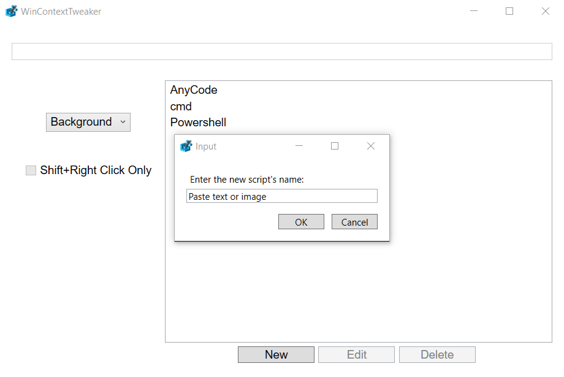
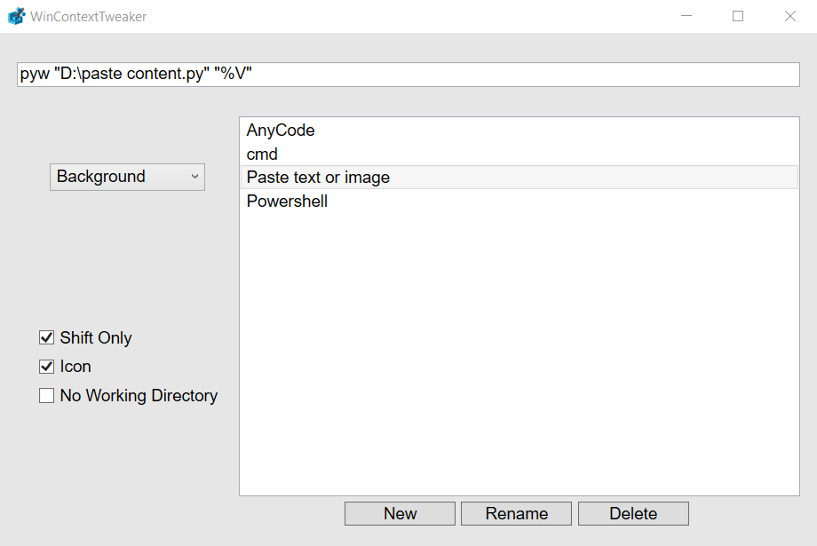
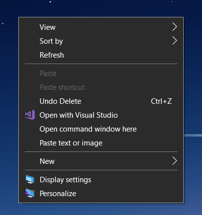

# WinContextTweaker
Free and Open-source Right Click Context Menu Editor for Windows.
You can download it in the releases tab.

You might have to install vc_redist and .NET 6.0

## Features
- Background, folders and file types context menu editing.
- Creation, renaming and deletion of context menu items, along with their scripts.
- Support for registry options (Shift only, Icon...).

&nbsp;

&nbsp;

&nbsp;

&nbsp;
## Changelog
- **v1.0.0**:
 - First release.

- **v1.1.0**:
 - Added "Icon" (with icon selection) and "No Working Directory" options.
 - Added "Text", "Document", "Image", "Video", "Audio" and "by extension" files context menus.
 - Fixed crashes and bugs.
