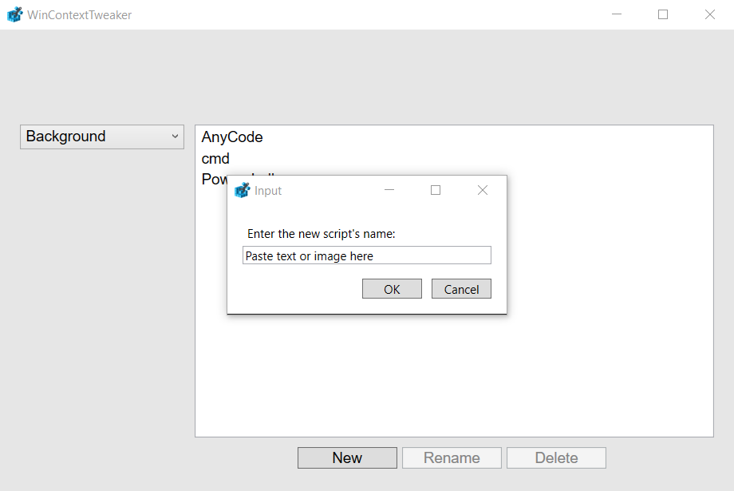
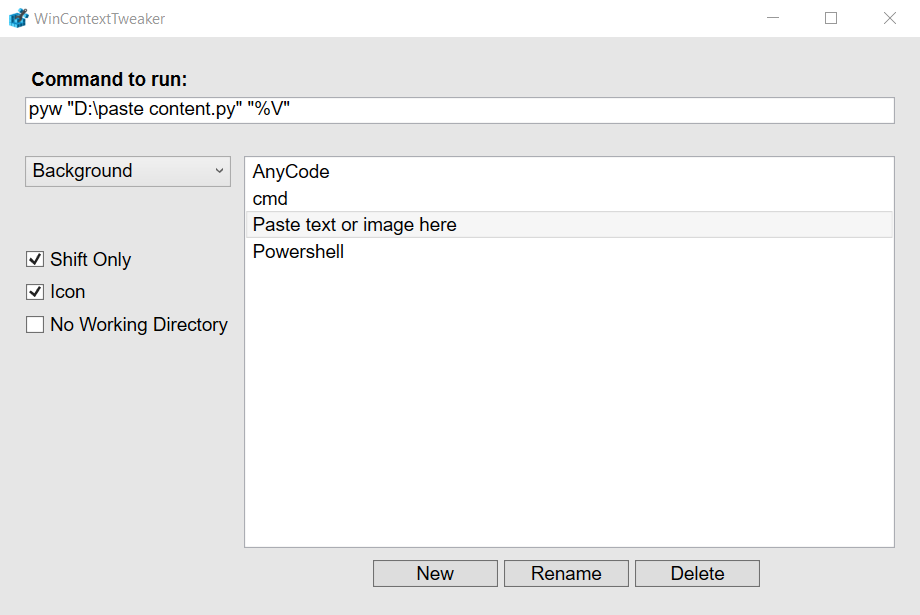
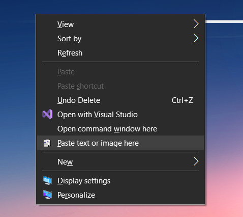

# WinContextTweaker
Free and Open-source Right Click Context Menu Editor for Windows.
You can download it in the releases tab.

If you are using Windows 7 or 8.1, remember to install the ".NET Framework 6.0" and its [dependencies](https://learn.microsoft.com/en-us/dotnet/core/install/windows?tabs=net60#additional-deps).

## Features
- Background, folders and specific file types context menu editing.
- Creation, renaming and deletion of context menu items, along with their scripts.
- Support for registry options (Shift only, Icon...).

## Tips
- Hover options to show a tooltip with more information.

- There are multiple command line variables. The ones that are most useful (and consistent) are:
  - "%V" – The selected item (file or folder).
  - "%W" – The working directory. Usually, this is the directory of the right-click, but not necessarily the selected item's parent folder (for example, when right-clicking shortcuts, "%V" returns the path of the actual item, while "%W" returns the shortcut's folder).

- If you are making changes using the actual Registry, you can update the scripts by pressing "F5" while using the program.

&nbsp;
## Screenshots (as of v1.1.0)

&nbsp;

&nbsp;

&nbsp;
## Changelog
_Note that any version might include a number of stylistic changes, which are often not documented to avoid cluttering the changelog_

- **v1.0.0**:
 - First release.

- **v1.1.0**:
 - Added "Icon" (with icon selection) and "No Working Directory" options.
 - Added "Text", "Document", "Image", "Video", "Audio" and "by extension" files context menus.
 - Fixed crashes and bugs.

- **v1.2.0**:
 - Added an "Hello World" default command.
 - Added informative tooltips.
 - Changed the elements padding to be more organized.

- **v1.3.0**:
 - Added a "No scripts was found" text.
 - Added an "F5" "Update" keybinding, for debugging purposes.
 - Changed the way a file extension gets selected.
 - Fixed bug where creating or renaming a script with an invalid name would crash the program.
 - Fixed bug where creating a script for a file extension that had no registry entry would not work.